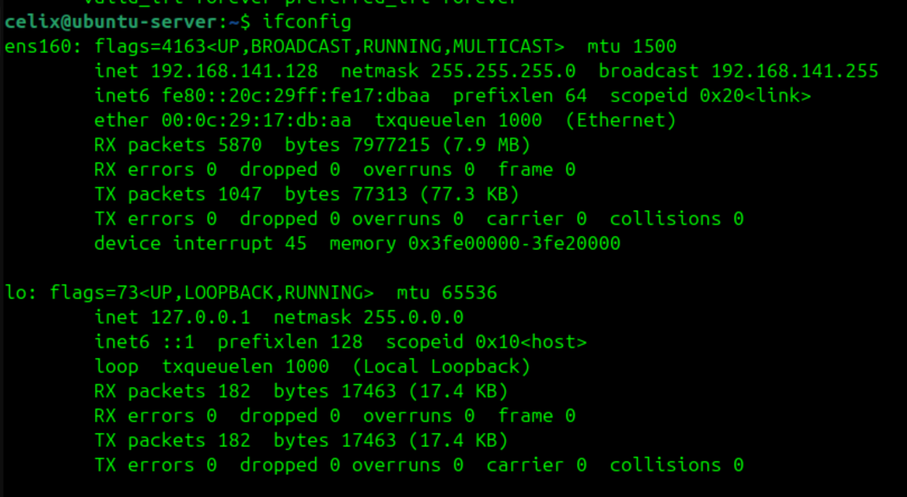
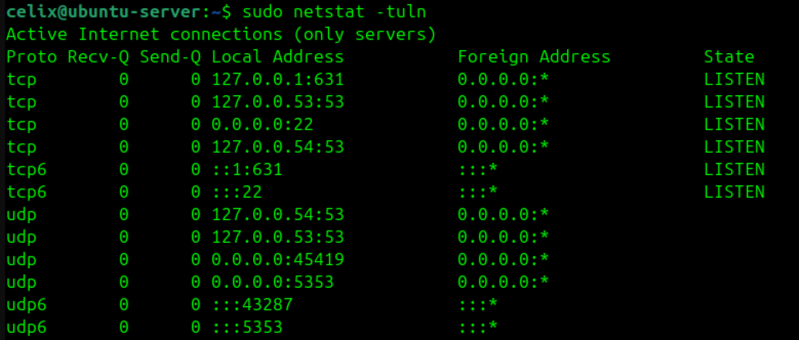
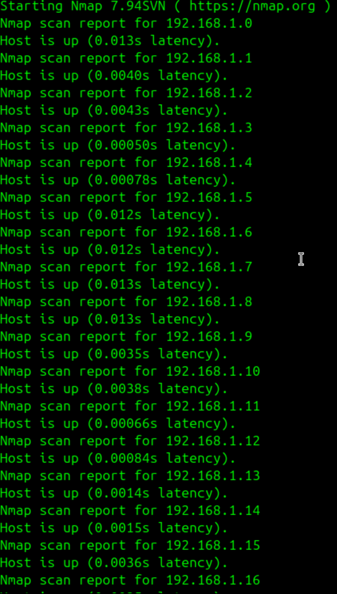
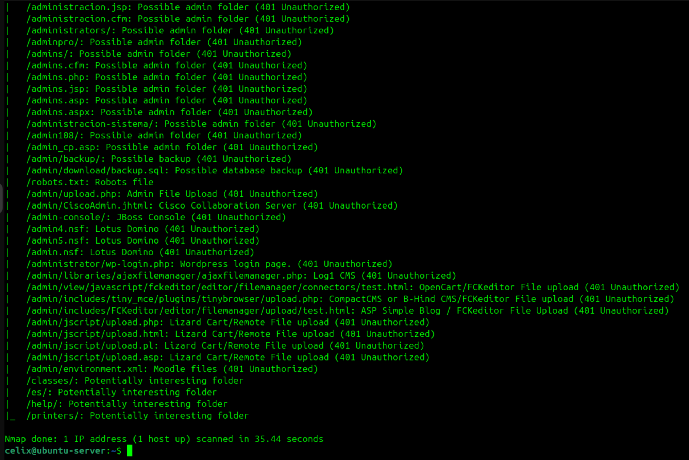
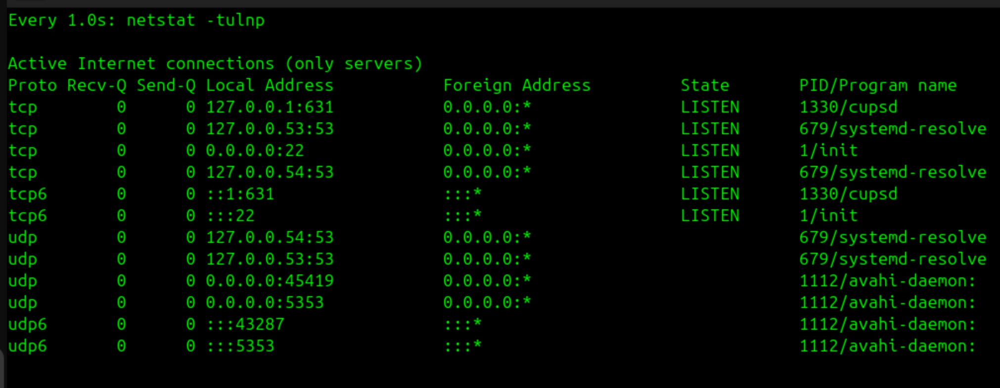
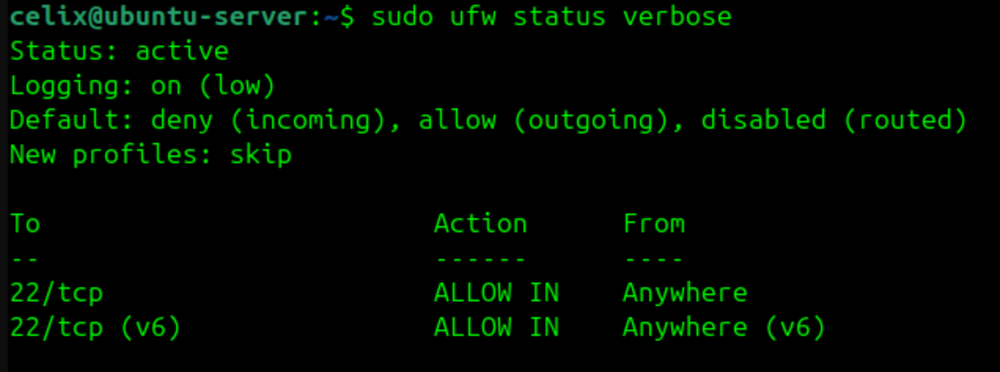

# Ubuntu Lab 

1) Identifying Network Interfaces and IP Addresses: 

Command: ip a 

**Screenshot:**

Command: ifconfig 

**Screenshot:**

Purpose: This command displays all network interfaces and their associated IP addresses on your server. Knowing which interfaces are active and their IP addresses helps you understand your server's network configuration.

Tool Explanation: ip a and ifconfig are utilities that provide detailed information about network interfaces, including their status (up or down), IP addresses, and more.

2) Checking Open Ports: 

Command: sudo netstat -tuln or ss -tuln 

**Screenshot:**

Purpose: Lists all open ports on the server along with the services listening on them. This helps you identify unnecessary open ports that could be potential entry points for attackers.

Tool Explanation: netstat and ss show network connections, routing tables, interface statistics, masquerade connections, and multicast memberships. The -tuln options restrict
the output to show only TCP (t) and UDP (u) ports in listening (l) state without resolving names (n).

3) Analyzing Network Connections: 

Command: sudo lsof -i -P -n 

**Screenshot:**

Purpose: Lists all open network connections, which can help you identify unexpected or unauthorized connections to your server.

Tool Explanation: lsof stands for 'list open files'. With the -i flag, it lists all network files, including their associated processes. The -P and -n flags prevent the resolution of port numbers and IP addresses, making the output easier to read and faster to generate.

4) Performing Network Scanning with Nmap

Command: sudo nmap -sS -O localhost

**Screenshot:**

Purpose: Scans your server to identify open ports, running services, and the operating system. This can help you discover services that are unintentionally exposed.

Tool Explanation: Nmap (Network Mapper) is a powerful network scanning tool used to discover hosts and services on a network. The -sS option performs a stealth TCP SYN scan, and -O attempts to determine the operating system of the target.

5) Checking for Open Ports on the Server's Network

Command: sudo nmap -sP 192.168.1.0/24

**Screenshot:**
 

**Screenshot:**
 

Purpose: Identifies all live hosts on your local network. This helps you understand the devices present in your network and ensures there are no unauthorized devices connected.

Tool Explanation: The -sP option in Nmap is a Ping Scan, which discovers which hosts on a network are up without performing a port scan.

6) Checking for Services and Versions

Command: sudo nmap -sV localhost

**Screenshot:**

Purpose: Scans for open ports and attempts to determine the service and version running on each port. This helps identify outdated or vulnerable software that might need updating.

Tool Explanation: The -sV option in Nmap enables version detection, providing detailed
information about the services running on open ports.

7) Identifying Potential Vulnerabilities

Command: sudo nmap --script vuln localhost

**Screenshot:**

Purpose: Uses Nmap's vulnerability scanning scripts to identify known vulnerabilities on theserver. This step is useful for finding common security issues in installed software.

Tool Explanation: Nmap has a scripting engine that allows for a wide range of scans. The --script vuln option runs scripts that check for various vulnerabilities.

8) Inspecting Network Traffic

Command: sudo tcpdump -i eth0

**Screenshot:**

Purpose: Monitors network traffic on a specific interface (e.g., eth0). This is helpful to observe real-time traffic and detect suspicious activities or anomalies.

Tool Explanation: tcpdump is a packet analyzer that captures and displays packet headers of network traffic passing through a specified interface.

9) Monitoring Network Connections in Real-Time

Command: sudo watch -n 1 netstat -tulnp

**Screenshot:**

Purpose: Continuously monitors network connections, updating every second (-n 1). This helps in real-time observation of network activities, such as new connections or services starting.

Tool Explanation: watch runs a specified command at regular intervals. In this case, it runs netstat to keep you updated about network connections in real time.

10) Checking Firewall Rules

Command: sudo ufw status verbose

**Screenshot:**

Purpose: Displays the current firewall rules configured on your server, showing which ports and services are allowed or blocked. This helps ensure that only necessary ports are open.

Tool Explanation: ufw (Uncomplicated Firewall) is a front-end for managing iptables, designed to make it easier to configure a firewall. The status verbose option provides a detailed view of the current firewall configuration.
