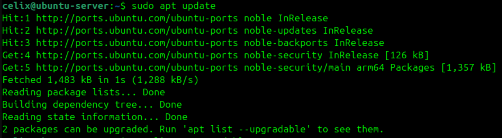
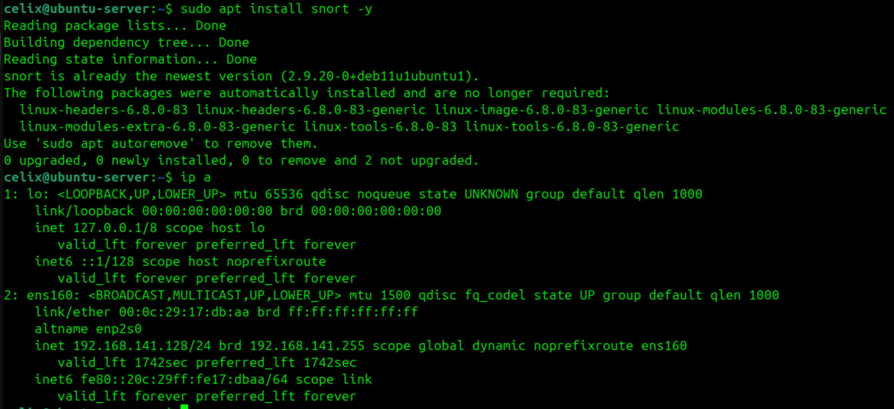
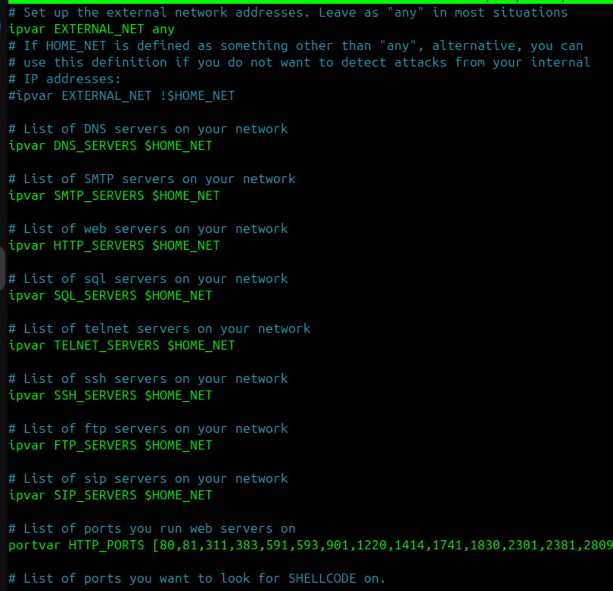
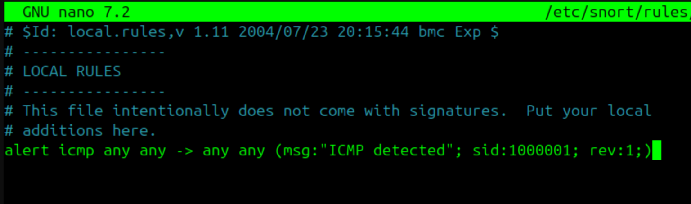
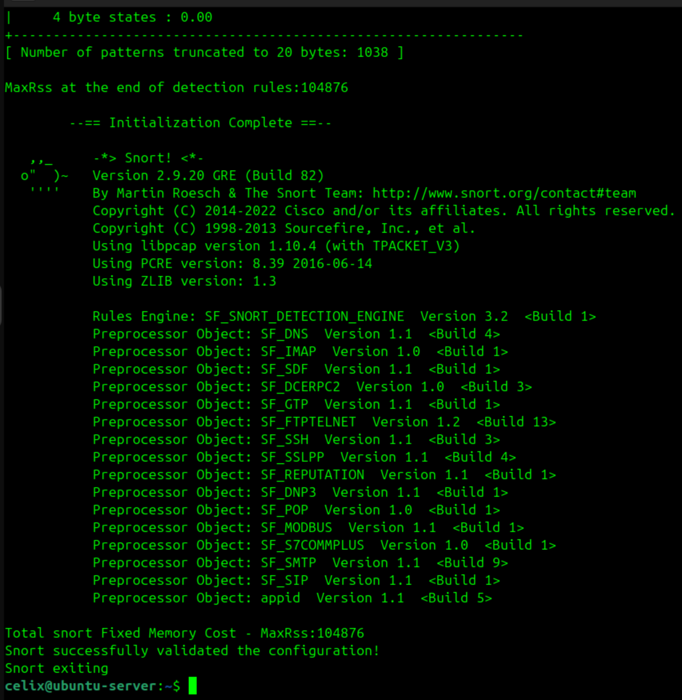
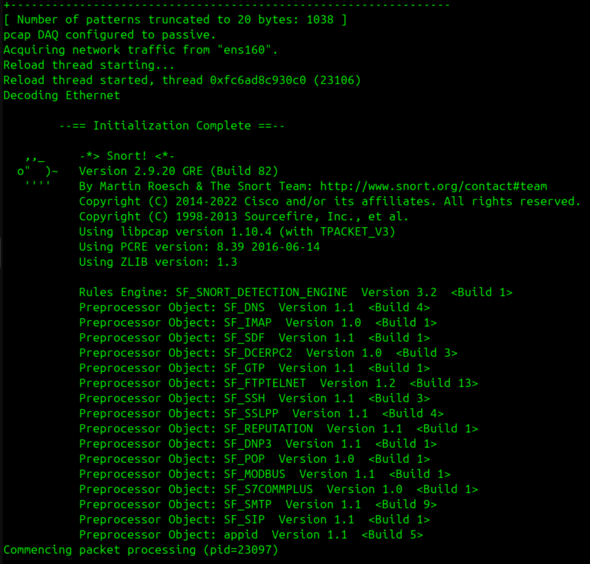
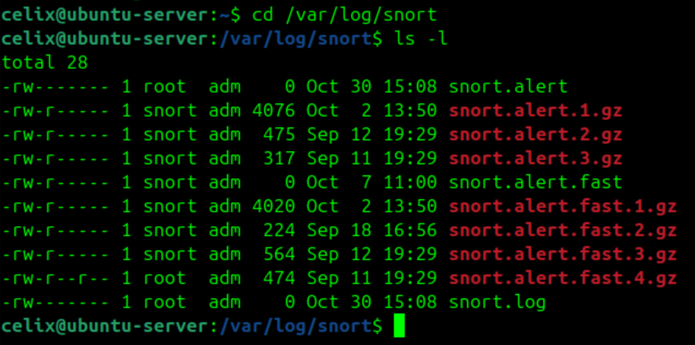
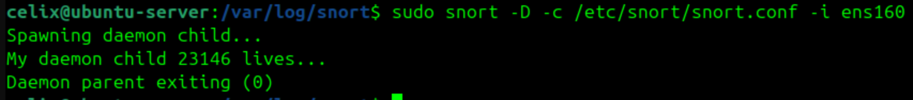

# Snort Intrusion Detection Setup (Personal Home Lab)

This project documents how I installed and configured **Snort** on my Ubuntu VM as part of building my personal home lab environment.  
Snort is an open-source **Network Intrusion Detection System (NIDS)** capable of analyzing traffic in real time and generating alerts when suspicious activity is detected.

1) Updating the System

Before starting, I updated my system to ensure everything was current:

Commands:
sudo apt update
sudo apt upgrade -y

I began by updating my Ubuntu system using sudo apt update and sudo apt upgrade -y to make sure all repositories and dependencies were current before installing Snort.
The screenshot above shows the successful update process and confirms that the system is ready for package installation.

2) Installing Snort

Commands:
sudo apt install snort -y

I installed Snort on my Ubuntu VM using sudo apt install snort -y and answered the installer prompts for my network interface and HOME_NET.
The screenshot above shows the successful installation and the Snort version check output, confirming the daemon and configuration files were placed under /etc/snort/.
Next I moved on to tweak snort.conf and add a simple local rule to validate alerting.

3) Configuring Snort 

Commands:
sudo nano /etc/snort/snort.conf
ipvar HOME_NET 192.168.1.0/24 

I reviewed and edited the main Snort configuration file at /etc/snort/snort.conf to ensure the HOME_NET variable matched my VM’s subnet.
After saving the changes, I tested the configuration with sudo snort -T -c /etc/snort/snort.conf, and the output confirmed that Snort successfully validated the setup.

4) Updating and Managin Snort Rules 

Commands:
sudo snort -T -c /etc/snort/snort.conf

I added a simple ICMP detection rule in /etc/snort/rules/local.rules.
This custom rule allows Snort to alert me whenever ICMP (ping) traffic is observed, helping verify that custom rule creation works correctly.
After saving and testing the configuration, Snort validated it successfully.

5) Testing Snort Configuration 

Commands:
sudo snort -T -c /etc/snort/snort.conf

I explored the snort.conf file to understand how Snort loads and manages its rule sets.
The screenshot above shows the section where dynamic and shared-object rule paths are defined.
I reviewed these includes to see how Snort organizes detection logic but kept the defaults unchanged for stability.
Afterward, I tested the configuration using sudo snort -T -c /etc/snort/snort.conf, and the validation completed successfully, confirming that the setup is correctly parsed and ready for rule customization.

6) Running Snort in IDS Mode 

Commands:
sudo snort -c /etc/snort/snort.conf -i ens160
sudo snort -c /etc/snort/snort.conf -i enX0

I successfully launched Snort in IDS mode using sudo snort -c /etc/snort/snort.conf -i ens160.
The initialization output confirmed that Snort loaded all preprocessors and began real-time packet analysis.
Once it was running, I generated ICMP traffic using ping, and Snort detected the packets based on my custom rule, confirming that the IDS was functioning correctly.

7) Viewing Snort Logs 

Commands:

I navigated to /var/log/snort/ to review Snort’s log files.
The directory contained multiple alert and log archives created during different monitoring sessions.
These files store detection events such as my ICMP alert rule, confirming that Snort is properly logging activity for later analysis.

8) Running Snort as a Daemon 

Commands:
sudo snort -c /etc/snort/snort.conf -i eth0

I started Snort in daemon mode using sudo snort -D -c /etc/snort/snort.conf -i ens160, which launched it as a background process for continuous network monitoring.
The output confirmed the process ID of the daemon, showing that Snort was running silently in the background and ready to log any detected network activity.
This completed the setup of my personal intrusion detection system, allowing Snort to operate as a persistent monitoring service.