# UFW Firewall Lab 

Part 1: Uncomplicated Firewall (UFW) Configuration & Logging

1) Checking the status of UFW 

Command: sudo ufw status

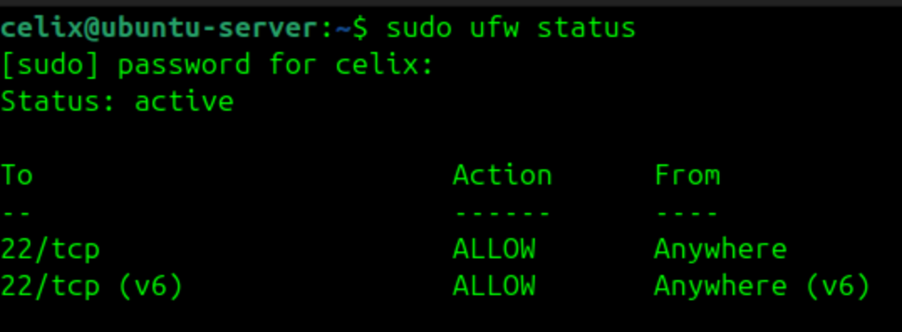

Output: UFW is already active, and SSH (22/tcp and 22/tcp (v6)) is allowed from anywhere by default.

2) Making sure my connection to ssh is allowed using the following command:

Command: sudo ufw allow 22/tcp

**Screenshot:**
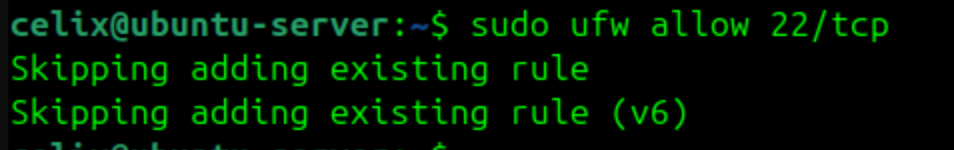

This case creates a question for us "If you are remotely accessing your server, why is it important to allow traffic through port 22 before enabling UFW?"

The answer for it is, if SSH (port 22) is not allowed before enabling UFW, the firewall would block the remote SSH connection and lock you out of the server.

3) Discovering Open / Listening Ports

Command: sudo ss -tuln

**Screenshot:**
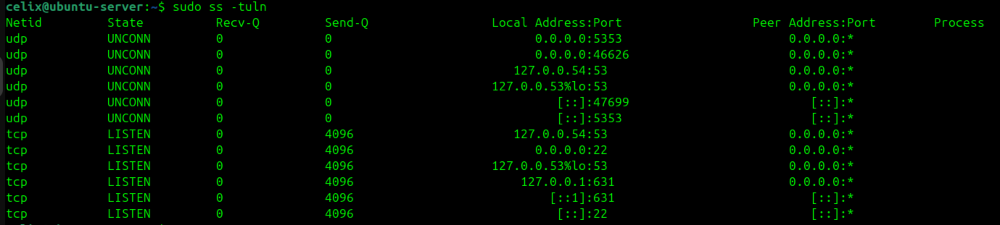

My observation:
This helped me see which services were listening for connections (TCP/UDP) and if there were unexpected ports open.

4) Enabling UFW

Command: sudo ufw enable

**Screenshot:**
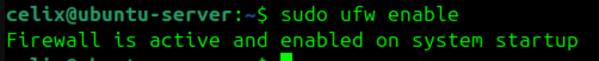

What this did:
This activated the firewall using the default policy: incoming traffic denied, outgoing allowed.

5) Rechecking Firewall Status

Command: sudo ufw status

**Screenshot:**
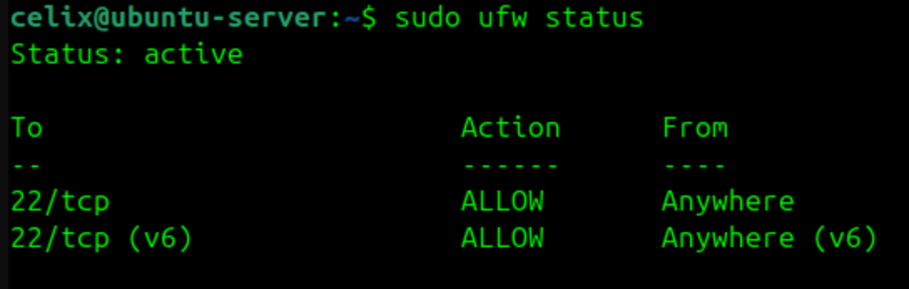

Observation:
Confirmed that the firewall was active and the SSH rule was still applied.

6) Opening Web Traffic Ports (If Hosting Web Services)

Commands: 
sudo ufw allow 80/tcp
sudo ufw allow 443/tcp

**Screenshot:**
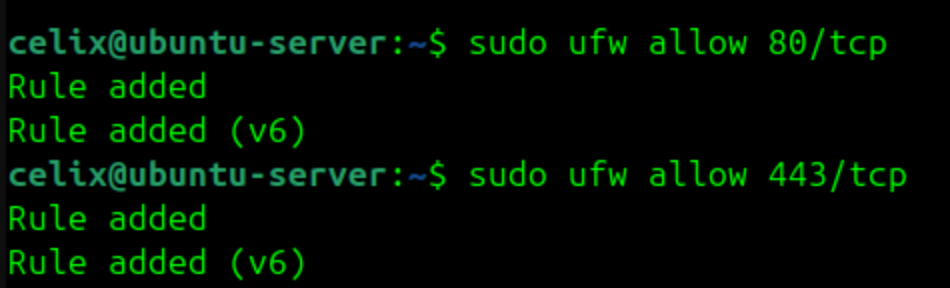

Why:
Port 80 is for HTTP, and port 443 is for HTTPS essential for any public-facing web server setup.

7) Verbose Firewall Status

Command: sudo ufw status verbose

**Screenshot:**
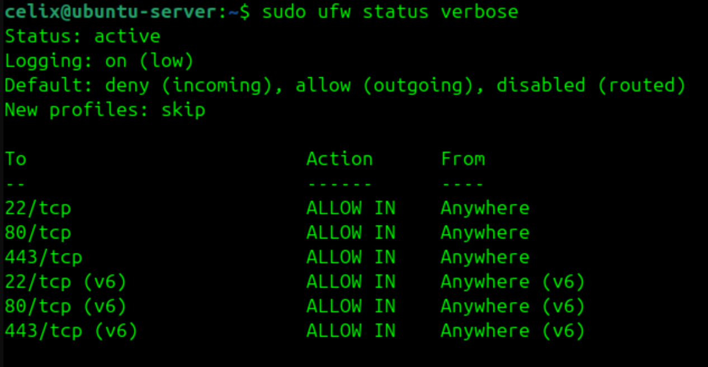

What stood out:
Verbose mode reveals the default policies, IPv6 settings, rule numbering, and logging level.

8) Blocking a Specific IP (Example Scenario)

Command: sudo ufw deny from 10.0.0.0 to any

**Screenshot:**
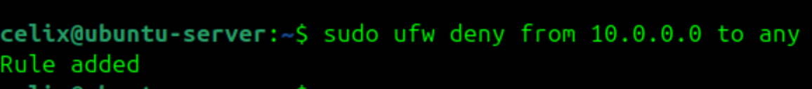

Purpose:
Good example of quickly blocking a known hostile IP.

9) Allowing a Host Access to a Single Port

Command: sudo ufw allow from 192.168.1.50 to any port 587 proto tcp

**Screenshot:**
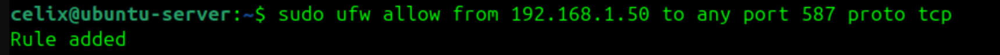

Why:
Port 587 is commonly used for secure email submission (SMTP over TLS), so allowing a trusted host access here makes sense in certain environments.

10) Confirming All Firewall Rules

Command: sudo ufw status numbered

**Screenshot:**
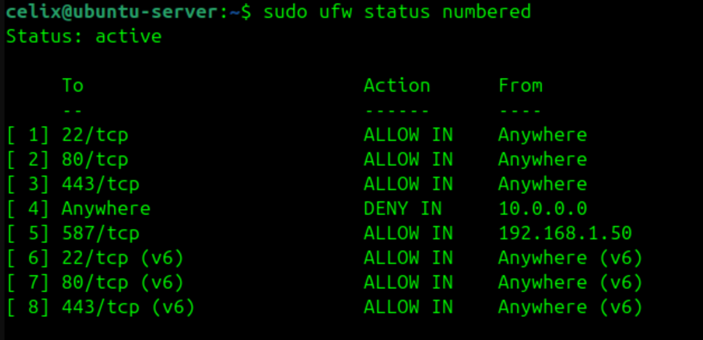

Why I checked this:
This view makes it easy to confirm rules were added and see their order.

Part 2: UFW Logging & Monitoring 

1) Enabling Firewall Logging

Command: sudo ufw logging on

**Screenshot:**
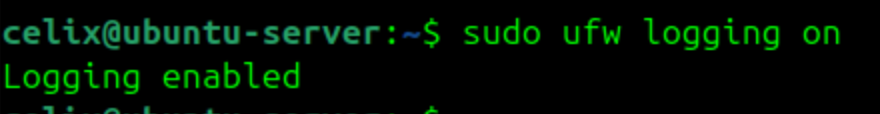

Reasoning:
This activates event tracking so I can audit block/allow behavior.

2) Setting Logging Level to High

Command: sudo ufw logging high

**Screenshot:**
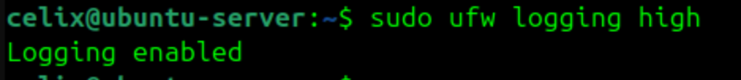

Why this level:
It gives deeper visibility into blocked and allowed packets without being as noisy as full logging.

3) Understanding the Log Format

A typical entry includes:
SRC (source IP)
DST (destination IP)
DPT/SPT (ports)
PROTO (protocol)
ACTION (e.g., UFW BLOCK)
MAC address
Timestamp and kernel log context

Why this is useful:
This makes it easier to spot attacks, unauthorized access attempts, and troubleshoot firewall behavior.

4) Live Log Monitoring

Command: sudo tail -f /var/log/ufw.log

**Screenshot:**
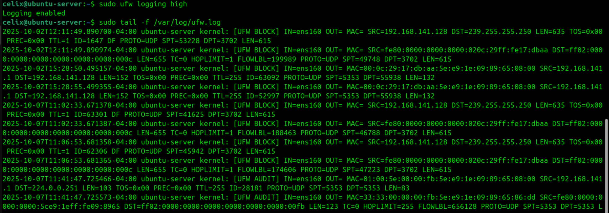

Note:
The -f flag streams the log in real time. I exited with Ctrl + C after watching the activity.

5) Filtering Allowed/Denied Connections

Commands: 
sudo grep 'DENY' /var/log/ufw.log
sudo grep 'ALLOW' /var/log/ufw.log

**Screenshot:**
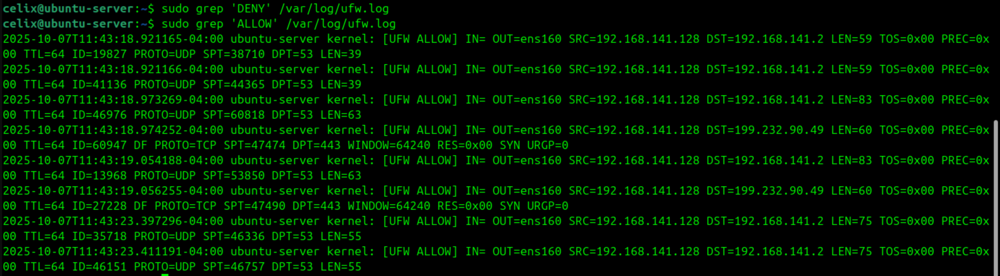

There are no DENY entries, it usually means no traffic has been blocked yet or rules are still too permissive.
